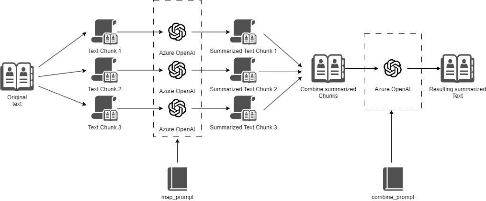
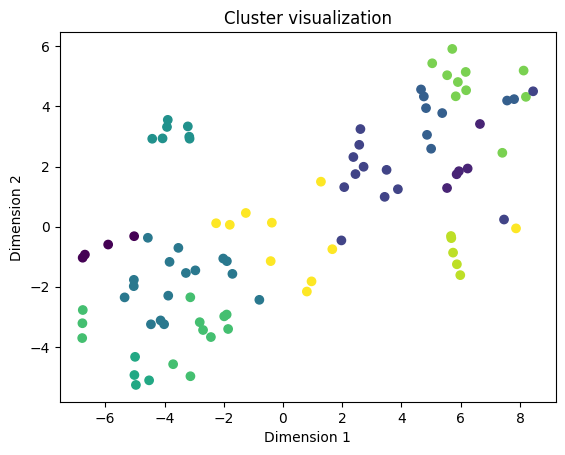

# Document Summary

**Motivation**

This is project related to our bachelor thesis. As a part of our project, we are to create summaries for tender competitions. These competitions come with a varying amount of documents, with varying length, file format and quality.

This project will be preparatory work for our bachelor project. We wish to explore different ways to summarize text using commercially available LLMs (Large Language Models). Since we do not know the documents we are to summarize, no specific cleaning or preprocessing can be done, everything has to be generic.

## Setup

You will need:
- Python 3.10 or higher
- A Python environment with all packages from [req.txt](req.txt) installed.
- An OpenAI API key, which can be aquired [here](https://openai.com/blog/openai-api). You will also need credits on your account.
- A .env file in the root of the project, containing your OpenAI API key. See [.env.example](.env.example).

## Document Summaries with Langchain

&nbsp; In this project we have been exploring different methods to summarize text using commercially available LLMs. To do this, we have used the framework Langchain extensively.

Langchain is a framework for developing applications powered by language models. You can read more about Langchain [here](https://python.langchain.com/docs/get_started/introduction).

**The summarization problem**

&nbsp; All LLMs have a token limit due to how they are designed and trained. This token limit gives a restriction on how much input you can give the LLM, and how much output you can expect back.

Here are some well known LLMs and their token limits:

| Model                      | Token Limit | Max Output Tokens |
|----------------------------|----------------|-------------------|
| GPT-4-Turbo-Preview        | 128 000        | 4096              |
| GPT-3.5-Turbo              | 16 385         | 4096              |
| Claude 3 Opus/Sonnet/Haiku | 200 000        | 4096              |

As we can see, most modern LLMs have a pretty big context window. But what if you want to summarize a huge document with over 500 pages, or maybe you have several documents to combine and summarize? This can quickly exceed the token limit if you want to do this in a single call to the LLM.

This means that summarizing the entire document at once is not always feasible, so we need new strategies for generating good summaries for long texts.

And, even if summarizing the entire document is possible, cost is an important factor. Commercial LLMs charge money per input and output token, and summarizing many huge documents will bloat the bill quickly.

### Stuffing the documents

[Check out the notebook for Document Stuffing here](stuffing.ipynb)

Document stuffing is a method used for smaller documents. Like the name says, this method "Stuffs" the document or documents into the prompt. In Langchain a Chain called "StuffDocumentsChain" is used.

 A StuffDocumentsChain prompt will typically describe the task, and then insert the document(s). However, as we have discussed earlier, this is not a good approch if you have large documents, because this chain only queries the API with one API call containing the whole document.

### Map Reduction

[Check out the notebook for Map Reduction here](map-reduction.ipynb)

Map reduction is another common approach for summarizing documents. This method is able to summarize documents which exceed the LLMs token limit by first breaking the documents into chunks which fit in the context window, then generating summaries for each chunk, and lastly generating a final summary from all the summaries.

This method lets us generate summaries for texts of arbitrary length (if the combined summaries are still too long, you can generate a summary from a group of summaries until they will fit in the context window), but as discussed earlier, cost is a problem. Map Reduction does many calls to the API, and will use a lot of input and output tokens in the process.

## Clustering

[Check out the notebook for clustering here](k-means-clustering.ipynb)

In this method, you first break the document into chunks, then generate *embeddings* from these chunks. An embedding in this context is a vector representation of text. We use embeddings because machine learning models work with numbers only, and cannot understand human readable text directly. Embeddings contain many dimensions and captures the semantic and syntactic meaning of a piece of text. If you embed many different words, semantically similar words like *tree* and *forest* will end up closer together in the vector space than semantically different words like *lion* and *truck*.

We can use this to our advantage when summarizing documents. If we embed all our chunks, then chunks that are talking about the same topic will be closer together in the vector space. Then, we can *cluster* the chunks together based on their semantic meaning. The image below shows a "squashed down" visualization (the embedding vectors have a dimension of 1536, here they are reduced to 2 dimensions) of the embedding vector space for a tender competition. 

To create these clusters, a clustering algorithm is used. The algorithm identifies clusters, then we find the center of the cluster and extract the nearest chunk, which will represent the "average meaning" of that cluster.

The goal of this method is to identify key topics in the text and assemble them to create a context-rich summary while spending as little as possible on API fees.

### Sources / Further reading

Summarizing long documents with AI - https://pashpashpash.substack.com/p/tackling-the-challenge-of-document

5 Levels of Summarization: Novice to Expert - https://github.com/gkamradt/langchain-tutorials/blob/main/data_generation/5%20Levels%20Of%20Summarization%20-%20Novice%20To%20Expert.ipynb

Clustering for QA - https://github.com/mendableai/QA_clustering/blob/main/notebooks/clustering_approach.ipynb